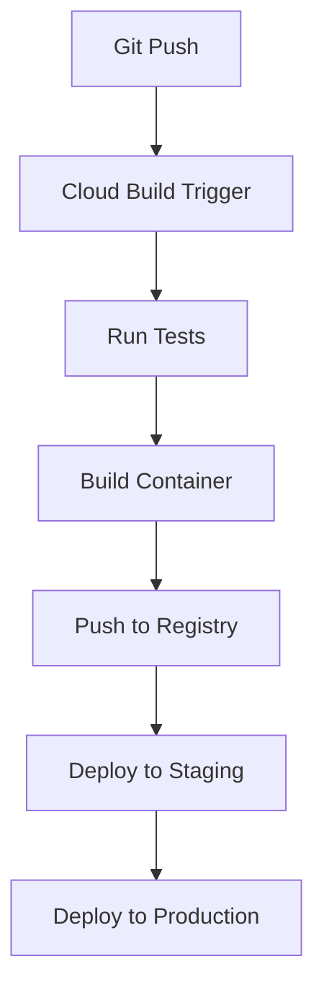

# Sales ETL Microservice

 


A robust HTTP-triggered ETL (Extract, Transform, Load) microservice built with Python and deployed to Google Cloud Run. This service processes sales transaction data in JSON format, performs validation and transformation, and loads it into BigQuery for analytics and reporting.

## ✨ Features

- **Data Validation** - Strict validation of incoming JSON sales transaction data against a predefined schema
- **Transformation** - Automatic calculation of tax, totals, and enrichment with timestamps and metadata
- **Loading** - Stores processed data into BigQuery
- **Containerized Deployment** - Packaged as a Docker container and deployed to Cloud Run for scalability
- **Automated CI/CD Pipeline** - Continuous integration and deployment with Google Cloud Build
- **Comprehensive Testing** - Extensive test coverage for all components ensuring reliability

## 🏗️ Technical Architecture

### System Components

| Component | Description |
|-----------|-------------|
| **HTTP Endpoint** | Serverless Cloud Run service exposing a HTTP endpoint for data ingestion |
| **Data Validation** | JSON Schema validation with detailed error reporting to ensure data integrity |
| **Data Transformation** | Business logic for tax calculation, total amount calculation and processed time |
| **BigQuery Integration** | ETL process to load cleaned data into BigQuery tables |
| **CI/CD Pipeline** | Fully automated deployment pipeline with testing |

### Project Structure

```
salesTransaction-http-etl/
├── src/
|   ├── __init__.py 
│   ├── main.py                # Main application file with Cloud Run service
│   ├── schema.py              # JSON schema validation
│   ├── transform.py           # Data transformation logic
│   ├── bigquery_loader.py     # BigQuery integration
│   └── config.py              # Configuration parameters
├── tests/
|   ├── __init__.py 
│   ├── test_schema.py         # Schema validation tests
│   ├── test_transform.py      # Transformation logic tests
│   └── test_bigquery_loader.py # BigQuery loading tests
├── bigquery_schema.json       # bigquery table schema definition
├── Dockerfile                 # Container definition
├── requirements.txt           # Python dependencies
├── .dockerignore              # Files to exclude from Docker build
├── cloudbuild.yaml            # CI/CD pipeline configuration
└── README.md                  # Project documentation
```

## Bigquery schema
Transactions are enriched with computed fields like tax and total amount, and a processing timestamp. Here's the schema used to define the target BigQuery table:


## ETL Pipeline


The pipeline has three main stages:
1. Extract → Receive & Validate JSON via HTTP
2. Transform → Enrich the data (e.g., tax, total amount and timestamp)
3. Load → Insert the clean record into BigQuery

**Testing:**
Each ETL stage is covered by unit tests to catch logic errors early in development. You can run all tests with:
```
pytest tests/
```

## 🔄 CI/CD Pipeline

The CI/CD pipeline automatically handles the entire development lifecycle:

1. Runs unit tests
2. Builds the Docker container
3. Pushes the container to Google Container Registry
4. Deploys to staging environment for verification
5. Deploys to production environment



## 📝 API Usage

Send HTTP POST requests to the deployed Cloud Run endpoint with JSON payloads representing sales transactions:
 
```bash
curl -X POST https://sales-etl-service-prod-752749770357.us-central1.run.app \
    -H "Content-Type: application/json" \
    -d '{
    "transaction_id": "TX1234567",
    "product_id": "P00135",
    "amount": 1410.0,
    "customer_id": "CUST172345"
    }'
```

### Example Response

```json
{
    "message": "Transaction processed successfully",
    "processed_at": "2025-05-03T14:32:23.425979",
    "status": "success",
    "transaction_id": "TX1234567"
}
```

### Error Handling

The API returns appropriate HTTP status codes with descriptive error messages:

- `400 Bad Request` - Invalid JSON payload or schema validation failure
- `401 Unauthorized` - Missing or invalid authentication
- `500 Internal Server Error` - Processing or database errors

## 💻 Local Development

### Prerequisites

- Python 3.9 or higher
- Google Cloud SDK installed and configured
- Docker (for container development)
- GCP service account with BigQuery permissions

### Setup Steps

1. Clone the repository
   ```bash
   git clone https://github.com/royal-dsouza/salesTransaction-http-etl
   cd sales-etl-service
   ```

2. Set up a virtual environment
   ```bash
   python -m venv venv
   source venv/bin/activate  # On Windows: venv\Scripts\activate
   ```

3. Install dependencies
   ```bash
   pip install -r requirements.txt
   ```

4. Configure environment variables
   ```bash
   export GCP_PROJECT="your_project_id"
   export BIGQUERY_DATASET="your_dataset"
   export BIGQUERY_TABLE="your_table"
   export GOOGLE_APPLICATION_CREDENTIALS="path/to/service-account-key.json"
   ```

5. Update the config.py with your service account details
   ```python
   # BigQuery settings (from environment variables with default fallback)
   PROJECT_ID = os.getenv("GCP_PROJECT", "your_project_id")
   DATASET_ID = os.getenv("BIGQUERY_DATASET", "your_dataset")
   TABLE_NAME = os.getenv("BIGQUERY_TABLE", "your_table")

   # Fully qualified BigQuery table ID
   BIGQUERY_TABLE_ID = f"{PROJECT_ID}.{DATASET_ID}.{TABLE_NAME}"

   SERVICE_ACCOUNT_FILE = os.getenv("GOOGLE_APPLICATION_CREDENTIALS", "path_to_your_credential_file")
   ```

6. Run tests
   ```bash
   python -m pytest tests/ -v
   ```

7. Start local development server
   ```bash
   python src/main.py
   ```

8. Build and test locally with Docker
   ```bash
   docker build -t sales-etl-service .
   docker run -p 8080:8080 \
     -e GCP_PROJECT="your_project_id" \
     -e BIGQUERY_DATASET="your_dataset" \
     -e BIGQUERY_TABLE="your_table" \
     -e GOOGLE_APPLICATION_CREDENTIALS="/tmp/keys/sa-key.json" \
     -v $(pwd)/path/to/service-account-key.json:/tmp/keys/sa-key.json:ro \
     sales-etl-service
   ```

## ☁️ Cloud Deployment

### GCP Project Setup

1. Enable required APIs
   ```bash
   gcloud services enable run.googleapis.com \
     cloudbuild.googleapis.com \
     bigquery.googleapis.com \
     containerregistry.googleapis.com
   ```

2. Configure service accounts and IAM roles
   ```bash
   # Create service account for the application
   gcloud iam service-accounts create sales-etl-service \
    --display-name="Sales ETL Service"
   
   gcloud projects add-iam-policy-binding ${PROJECT_ID} \
    --member="serviceAccount:${SERVICE_ACCOUNT}" \
    --role="roles/bigquery.dataEditor" \
    --role="roles/cloudbuild.logsWriter" \
    --role="roles/cloudbuild.serviceAgent" \
    --role="roles/cloudfunctions.invoker" \
    --role="roles/run.admin" \
    --role="roles/logging.logWriter" \
    --role="roles/secretmanager.secretAccessor" \
    --role="roles/iam.serviceAccountUser"
   ```

### CI/CD Setup

1. Clone the repository
   ```bash
   git clone https://github.com/royal-dsouza/salesTransaction-http-etl
   ```

2. Update substitutions in cloudbuild.yaml
   ```yaml
   substitutions:
     _BIGQUERY_DATASET_STG: your_staging_dataset
     _BIGQUERY_TABLE_STG: your_staging_table
     _BIGQUERY_DATASET: your_prod_dataset
     _BIGQUERY_TABLE: your_prod_table
   ```

3. Create Cloud Build trigger
   - Navigate to Cloud Build > Triggers
   - Click "Create Trigger"
   - Connect to GitHub repository
   - Configure trigger settings:
     - Name: `sales-etl-service-deploy`
     - Event: `Push to branch`
     - Repository: `your_repository`
     - Branch: `^main$`
     - Configuration: `Cloud Build configuration file (YAML)`
     - Location: `Repository`
     - File: `cloudbuild.yaml`
