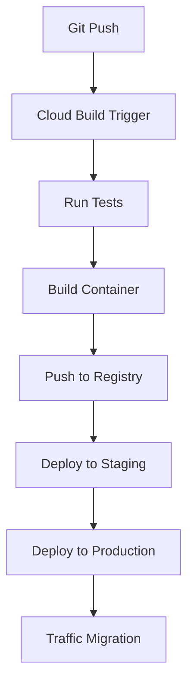

# Sales ETL Microservice

An HTTP-triggered ETL (Extract, Transform, Load) microservice built with Python and deployed to Google Cloud Run. This service processes sales transaction data in JSON format, performs validation and transformation, and loads it into BigQuery.

## ✨ Features

- **Validation** - Validates incoming JSON sales transaction data against a predefined schema
- **Transformation** - Calculates tax, totals, and enriches with timestamps
- **Loading** - Stores processed data into BigQuery for analysis and reporting
- **Containerized** - Packaged as a Docker container and deployed to Cloud Run
- **CI/CD Pipeline** - Automated testing, building, and deployment with Google Cloud Build
- **Unit Testing** - Comprehensive test coverage for all components

## 🏗️ Technical Architecture

### System Components

| Component | Description |
|-----------|-------------|
| **HTTP Endpoint** | Cloud Run service exposing an HTTP endpoint for data ingestion |
| **Data Validation** | JSON Schema validation to ensure data integrity |
| **Data Transformation** | Business logic for tax calculation and data enrichment |
| **BigQuery Integration** | ETL process to load cleaned data into BigQuery tables |
| **CI/CD Pipeline** | Automated deployment pipeline with testing and traffic management |

### Project Structure

```
sales-etl-service/
├── src/
│   ├── main.py                # Main application file with Cloud Run service
│   ├── schema.py              # JSON schema validation
│   ├── transform.py           # Data transformation logic
│   ├── bigquery_loader.py     # BigQuery integration
│   └── config.py              # Configuration parameters
├── tests/
│   ├── test_schema.py         # Schema validation tests
│   ├── test_transform.py      # Transformation logic tests
│   └── test_bigquery_loader.py # BigQuery loading tests
├── Dockerfile                 # Container definition
├── requirements.txt           # Python dependencies
├── .dockerignore              # Files to exclude from Docker build
├── cloudbuild.yaml            # CI/CD pipeline configuration
└── README.md                  # Project documentation
```

## 🚀 Deployment

The service is deployed as a containerized application on Google Cloud Run, which provides:

- ⚡ Automatic scaling based on demand
- 🔒 HTTPS endpoint with authentication support
- 💰 Pay-per-use billing model

## 🔄 CI/CD Pipeline

The CI/CD pipeline automates the following steps:

1. Run unit tests
2. Build the Docker container
3. Push the container to Google Container Registry
4. Deploy to staging environment
5. Deploy to production with traffic splitting (0% traffic initially)
6. Gradually shift traffic to the new production version



## 📝 API Usage

Send HTTP POST requests to the deployed Cloud Run endpoint with JSON payloads representing sales transactions:

```bash
curl -X POST https://your-cloud-run-url.a.run.app \
    -H "Content-Type: application/json" \
    -d '{
        "transaction_id": "TX-12345",
        "customer_id": "CUST-001",
        "sale_date": "2023-05-01T14:30:00Z",
        "items": [
            {
                "product_id": "PROD-001",
                "product_name": "Widget A",
                "quantity": 2,
                "unit_price": 10.99
            },
            {
                "product_id": "PROD-002",
                "product_name": "Widget B",
                "quantity": 1,
                "unit_price": 24.99
            }
        ],
        "payment_method": "credit_card",
        "store_id": "STORE-001"
    }'
```

### Example Response

```json
{
    "status": "success",
    "message": "Transaction processed successfully",
    "transaction_id": "TX-12345",
    "processed_at": "2023-05-01T14:35:22.123456"
}
```

## 💻 Development Setup

1. Clone the repository
   ```bash
   git clone https://github.com/your-username/sales-etl-service.git
   cd sales-etl-service
   ```

2. Install dependencies
   ```bash
   pip install -r requirements.txt
   ```

3. Run tests
   ```bash
   python -m pytest tests/ -v
   ```

4. Run locally
   ```bash
   functions-framework --target=process_sales_transaction --debug
   ```

5. Build container locally
   ```bash
   docker build -t sales-etl-service .
   docker run -p 8080:8080 sales-etl-service
   ```

## ⚙️ Environment Variables

| Variable | Description | Default |
|----------|-------------|---------|
| `GCP_PROJECT` | Google Cloud Project ID | `your-project-id` |
| `BIGQUERY_DATASET` | BigQuery dataset name | `sales_data` |
| `BIGQUERY_TABLE` | BigQuery table name | `transactions` |
| `DEBUG_MODE` | Enable debug mode | `False` |
| `LOG_LEVEL` | Logging level | `INFO` |

## 📋 Prerequisites

- Google Cloud Platform account with:
  - BigQuery API enabled
  - Cloud Run API enabled
  - Cloud Build API enabled
  - Appropriate service accounts and permissions
- Docker (for local container development)
- Python 3.9+
